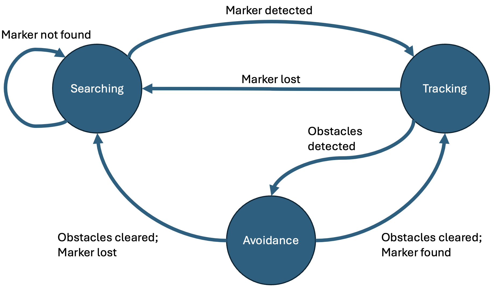

# FlyingGuideDog
Indoor Guide Drone for Visually Impaired People

## Current work
Currently using canny edge detector for obstacle detector. However, avoidance mode is too easily activated. Trying to fix this. 

## Typical Flow of Function Calls
Here’s a sample sequence of function calls based on state machine implementation:
1. Drone Startup:
    * capture_frames() starts capturing video frames.
    * The drone begins in None mode.
2. SEARCHING Mode:
    * track_aruco_marker() attempts to detect the marker.
    * If the marker is found:
        * Transition to TRACKING mode.
    * If not found:
        * search_with_memory() uses previous marker position and direction.
3. TRACKING Mode:
    * track_aruco_marker() continues tracking the marker.
    * If an obstacle is detected:
        * Transition to AVOIDANCE mode by calling detect_obstacle().
    * If the marker is lost:
        * Transition back to SEARCHING.
4. AVOIDANCE Mode:
    * detect_obstacle() identifies obstacles and their proximity.
    * avoid_obstacle(obstacles) dynamically adjusts drone movement based on obstacle proximity.
    * Once obstacles are cleared:
        * Check for the marker using track_aruco_marker().
        * Transition to either TRACKING or SEARCHING, depending on whether the marker is found.

## Functions description 

track_aruco_marker()
- Detect ArUco markers and track with marker memory, i.e. last_marker_direction, last_marker_position, last_marker_time. Return True if marker found.

track_obj()
- Control yaw, left/right, front/back, up/down movement using PD controllers based on the marker's position and area

detect_obstacle()
- Detect obstacles in the drone's path using Canny edge detection and contour analysis by dividing the frame into regions with proximity information.

avoid_obstacle()
- Avoid obstacles by sending RC commands with speed adjustments based on proximity information from different regions.

search_memory()
- Search for ArUco marker using memory of its last known position and direction.

capture_frames()
- State machine to control the drone's behavior based on the current mode and detected obstacles by continuously capturing frames and listening for key presses

