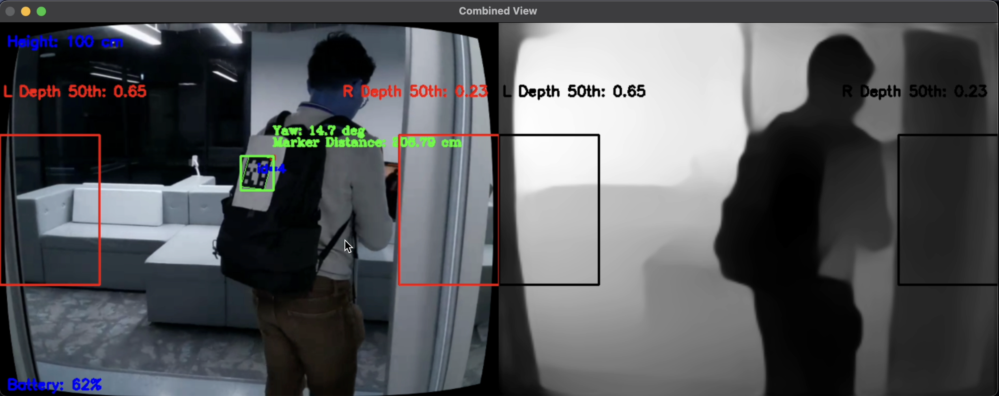
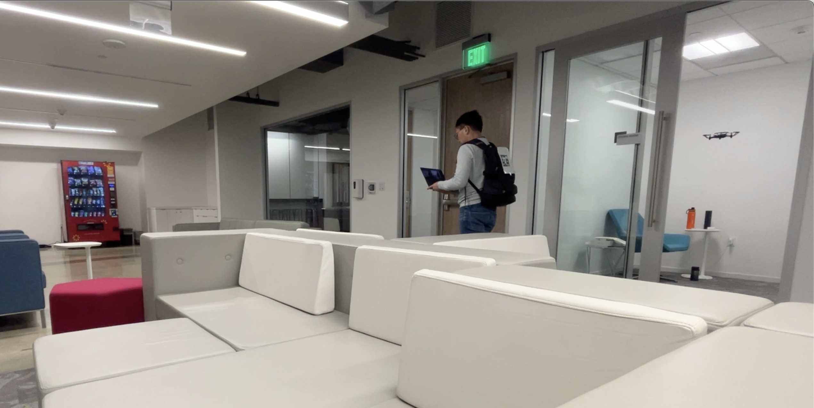
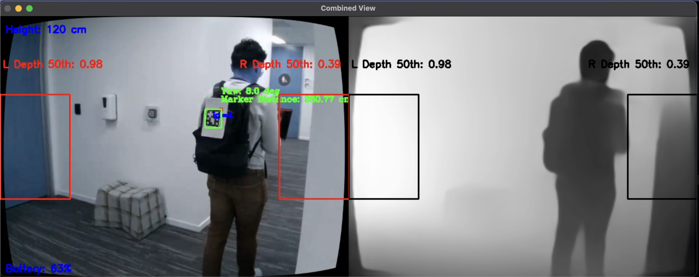
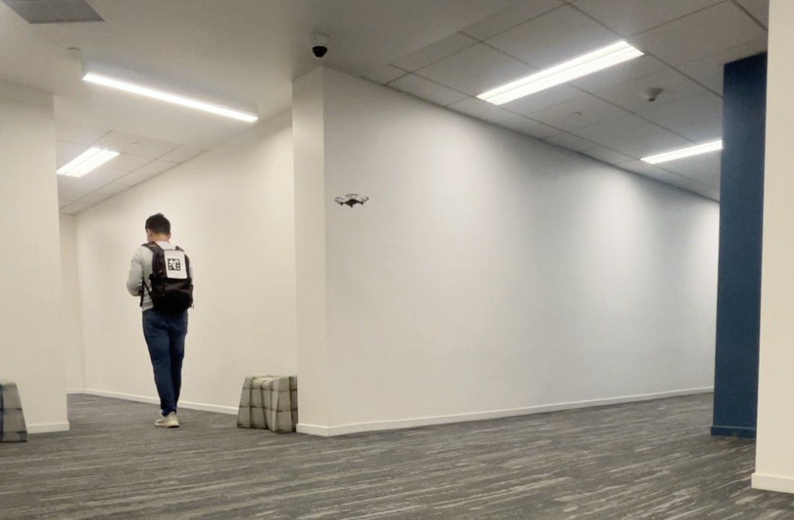
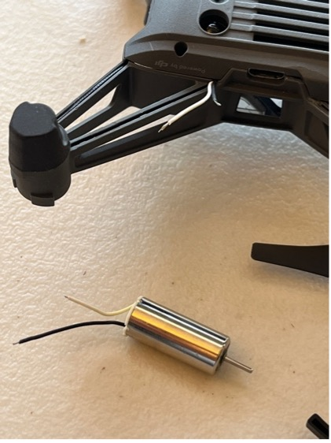
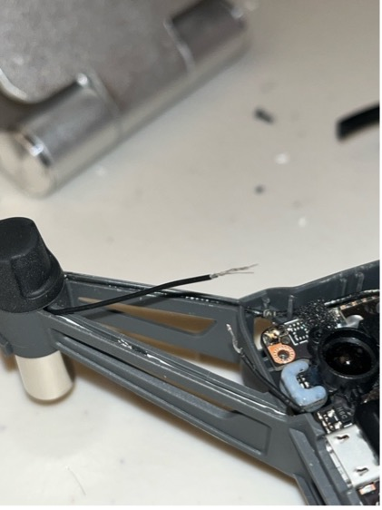
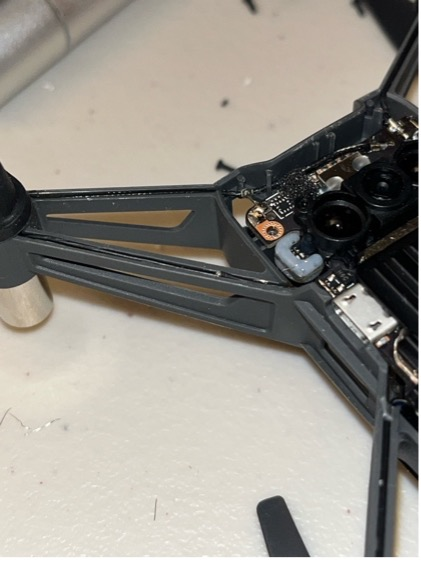
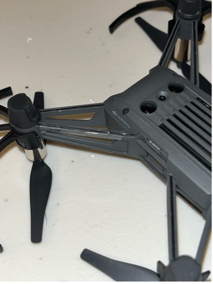

# 👨‍💻Indoor Navigation Drone with Real-Time Person Tracking and Obstacle Avoidance  🤖

**Author:** Au, Chin Yuen (Isaac)

## 📌 Project Overview
Project Goal: This project focuses on the core real-time navigation system for a future **“Flying Guide Dog”**—an “over‑the‑shoulder” assistive companion drone designed to help visually impaired individuals navigate complex indoor environments safely and autonomously, thus enhancing indoor mobility. Conventional drone systems encounter significant challenges in indoor environments, primarily due to the **absence of GPS signals**, unreliable obstacle detection under **varying lighting conditions**, and unstable target tracking in dynamic scenes.

This work delivers:
- **Reliable person-following** via ArUco marker tracking  
- **Monocular obstacle avoidance** powered by MiDaS depth estimation  
- **Smooth PD control** for stable and responsive flight behavior

| DJI Tello EDU                                 | ArUco marker                                      |
|---------------------------------------------- |---------------------------------------------------|
| | |

## 🚀 Features

| Component                        | Description |
|----------------------------------|-------------|
| 🎯 **ArUco Marker Tracking**     | Primary tracking system using marker pose (position + yaw angle) |
| 🛑 **Obstacle Avoidance**        | MiDaS depth estimation + spatial logic for halting or rerouting |
| 📡 **PD Control**                | Smooth real-time drone control across yaw, up/down, forward/backward, and lateral axes |
| 🔄 **Dynamic Turn Handling**     | Adjusts drone behavior based on yaw angle changes (turns) to minimize corner collisions |
| 🧠 **State-Aware Logic**         | Transitions between ArUco tracking mode and obstacle avoidance override |
| 🖥️ **Live Video + Debug UI**     | Real-time annotations: marker box, yaw angle, fallback IDs, obstacle warnings, depth map |

## 📂 Repository Structure

```
.
├── assets/                                   # Example outputs, evaluation images, logs
├── src/
|   ├──droneMain.py                           # Unified control script
├── README.md
├── requirements.txt
```

## 🧠 Methodology

### 1. **ArUco Marker Detection**
- Marker detector: `cv2.aruco.ArucoDetector.detectMarkers`
- Pose estimation: `cv2.solvePnP`
- Extracts marker center, distance, and yaw angle from `rvec` + `tvec`
- Used to derive control commands:
  - `yaw` → align heading with marker angle
  - `lr`  → lateral correction
  - `fb`  → forward-backward distance control
  - `ud`  → altitude stabilization
- Maintains smooth control using visual tracking and position memory

### 2. **Obstacle Avoidance**
- Uses MiDaS to generate depth maps
- Assume obstacle apperance on sides as this project focuses on target tracking
- If mean depth in Region of Interest(ROI) < threshold, halts or redirects
- Obstacle override has highest priority

### 3. **PD Controller with Smoothing**
- Stabilizes drone motion via proportional-derivative control
- Smooths jitter using:
  - Low-pass filtering
  - Deadbands and clipping
  - Turn-based dynamic acceleration logic

## 🧪 Evaluation

| Metric                             | Value / Notes |
|-----------------------------------|----------------|
| ArUco Tracking Latency            | ~7 ± 1 ms                              |
| End-to-End Avoidance Success      | 90% of 30 indoor corner runs           |
| Turn Responsiveness               | Drone reduces radius and accelerates during sharp marker yaw changes |
| Stability                         | Controlled oscillation with PID smoothing and min-speed gating       |

## 🧪 Example Output

| Drone Camera View <br/> BGR Frame(Left), Depth Map (Right)  | Third person point of view |
|-------------------------------------------------------- |--------------------------- |
|      |  | 
|     |  | 

## 🕹️ Requirements
This project is tested on Apple M1 Pro chip. The following libraries and frameworks are required:
- Python 3.10+
- OpenCV
- NumPy
- PyTorch
- djitellopy (DJI Tello SDK)

Install with:
```bash
pip install -r requirements.txt
```

## 🎮 Controls

| Key | Action             |
|-----|--------------------|
| `s` | Takeoff            |
| `l` | Land               |
| `q` | Emergency Quit     |

## 🧩Discussion
While the broader “Flying Guide Dog” initiative envisions features like human-drone interaction, voice feedback, and semantic scene understanding, this project provides the **foundational autonomous navigation engine** that makes those higher-level features possible. <br/>

Notably, this system is designed to run entirely on a **DJI Tello EDU** — a **lightweight**, **low-cost** drone with **limited onboard sensing and only one forward-facing camera**. Overcoming these constraints required rethinking traditional robotics pipelines and optimizing real-time computer vision to work under tight hardware limitations.  <br/>

## 💡 Conclusion 
By **empowering entry-level drones** with advanced real time autonomous behavior, this project enhances **accessibility, scalability, and affordability**, paving the way for assistive drone technologies to reach a **wider audience** beyond high-end, research-grade hardware.

Future work includes
- semantic scene understanding with more complex models
- integrating LLM voice assistant for human interaction
- hardware enhancement such as extra cameras or proximity sensors for improved spatial awareness
- eliminate the usage of visual marker while maintaining performance under dynamic environment

## 🛠️ Appendix: Replacing drone motor without soldering

Replacing a damaged or worn-out motor on the DJI Tello EDU can be done without soldering, making it more accessible for beginners and faster for prototyping.
The visual guide below outlines each step, enabling quick motor swaps using only basic tools.

|    Identifying the correct motor orientation     | Clockwise (Blue/Black) or <br/> Counter-clockwise(White/Black)| 
| ----------------------------------------------   | ------------------------------------------------           |
| |           |
| Reconnecting wires with <br/> staggered lengths to prevent short circuits | Securing wires with non-conductive tape | 
| |           |

## Contribution
Au, Chin Yuen (Isaac): Designed and implemented the complete system architecture, integrated ArUco tracking and MiDaS depth-based avoidance, tuned PD controllers, performed tests and evaluation, wrote documentation and deployment instructions.

## References
MiDaS: Ranftl et al., CVPR 2021 <br/>
ArUco: Garrido-Jurado et al., Pattern Recognition 2014 <br/>
DJI Tello SDK docs <br/>
Tello EDU Motor replacement: https://youtu.be/jU3gfmurPMk?si=GEEZ-b87soSrQNEm

## 👨‍🏫 Acknowledgements

This project is part of a research initiative at Northeastern University under the guidance of Prof. Ilmi Yoon and Prof Jeongkyu Lee.  
Special thanks to DJI Tello EDU SDK and open-source contributions from MiDaS, Deep SORT, and Ultralytics.
