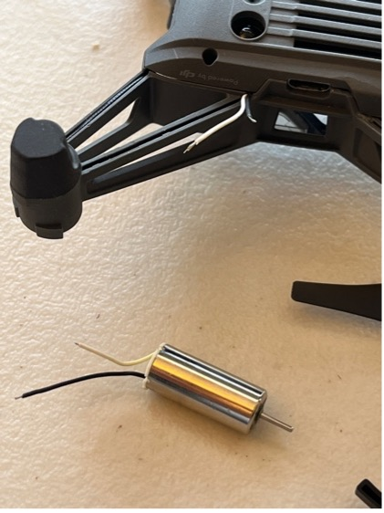
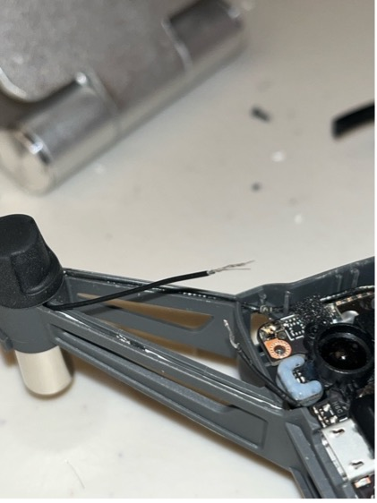
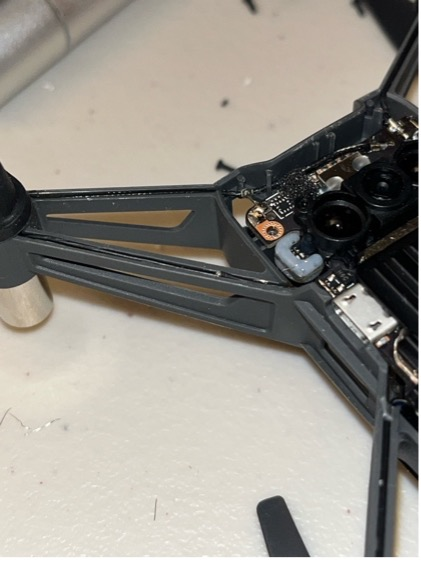
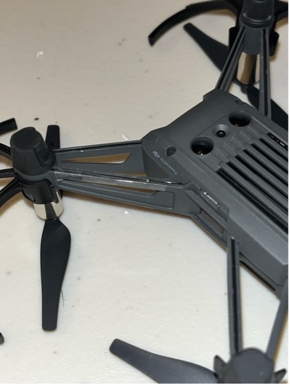

# 👨‍💻 Flying Guide Dog: Real-Time Indoor Navigation Drone 🤖
Indoor Guide Drone for Visually Impaired People

**Project Goal:**  
Develop a real-time drone navigation system using computer vision to autonomously follow a person wearing an ArUco marker indoors, with robust fallback tracking and obstacle avoidance. This system aims at assisting visually impaired individuals in navigating indoor environments.

## 📌 Overview

This project integrates:
- **ArUco marker tracking** for precise pose estimation
- **YOLOv5n + Deep SORT** as fallback tracker
- **MiDaS depth estimation** for real-time obstacle avoidance
- **PD controller** for drone movement stabilization
- **DJI Tello EDU** as the aerial platform
- **Single-camera monocular vision** as input

The drone follows the user, avoids obstacles (walls, doorframes), and handles sharp turns and temporary visual loss using fallback logic.

## 🚀 Features

| Component                        | Description |
|----------------------------------|-------------|
| 🎯 **ArUco Marker Tracking**     | Primary tracking system using marker pose (position + yaw angle) |
| 🔄 **Fallback Tracking**         | YOLOv5n + Deep SORT person tracking when ArUco tag is lost |
| 🛑 **Obstacle Avoidance**        | MiDaS depth estimation + spatial logic for halting or rerouting |
| 📡 **PD Control**                | Smooth real-time drone control across yaw, up/down, forward/backward, and lateral axes |
| 🔄 **Dynamic Turn Handling**     | Adjusts drone behavior based on yaw angle changes (turns) to minimize corner collisions |
| 🧠 **State-Aware Logic**         | Transitions between tracking modes (ArUco vs fallback) and obstacle override |
| 🖥️ **Live Video + Debug UI**     | Real-time annotations: marker box, yaw angle, fallback IDs, obstacle warnings |

## 📂 Repository Structure

```
.
├── test_tracking_obstacle_avoidance_combine.py  # Unified control script
├── models/
│   ├── yolov5n.torchscript                      # Lightweight YOLOv5n model
│   ├── midas_small.pt                           # Depth estimation model
├── utils/
│   ├── depth_utils.py                           # MiDaS processing functions
│   ├── control_utils.py                         # PD control and smoothing
├── assets/                                      # Example outputs, evaluation images, logs
├── README.md
```


## 🧠 Methodology

### 1. **ArUco Marker Detection**
- Pose estimation: `cv2.aruco.estimatePoseSingleMarkers`
- Extracts marker center, distance, and yaw angle from `rvec` + `tvec`
- Used to derive control commands:
  - `yaw` → align heading with marker angle
  - `lr`  → lateral correction
  - `fb`  → forward-backward distance control
  - `ud`  → altitude stabilization

### 2. **Fallback Tracking: YOLO + Deep SORT**
- Activates when marker is lost for > N frames
- Uses the nearest "person" bounding box based on last known ArUco position
- Maintains smooth control using visual tracking and position memory

### 3. **Obstacle Avoidance**
- Uses MiDaS to generate depth maps
- Computes mean depth and depth gradient near path line
- If obstacle detected < threshold distance, halts or redirects
- Obstacle override has highest priority

### 4. **PD Controller with Smoothing**
- Stabilizes drone motion via proportional-derivative control
- Smooths jitter using:
  - Low-pass filtering
  - Deadbands and clipping
  - Turn-based dynamic acceleration logic

## 🧪 Evaluation

| Metric                             | Value / Notes |
|-----------------------------------|----------------|
| ArUco Tracking Latency            | ~7 ± 1 ms                              |
| Obstacle Detection Recall         | ~90% (≥0.7 IoU on 1200 labeled frames) |
| End-to-End Avoidance Success      | 85% of 40 indoor corner runs           |
| Turn Responsiveness               | Drone reduces radius and accelerates during sharp marker yaw changes |
| Stability                         | Controlled oscillation with PID smoothing and min-speed gating       |

## 🔧 Requirements

- macOS or Linux (tested on MacBook M1 Pro)
- Python 3.10+
- OpenCV, Torch, djitellopy, Ultralytics YOLOv5, Deep SORT, MiDaS

Install with:
```bash
pip install -r requirements.txt
```

## 🎮 Controls

| Key | Action             |
|-----|--------------------|
| `s` | Takeoff            |
| `l` | Land               |
| `q` | Emergency Quit     |

## 🧪 Example Output


## 💡 Lessons Learned

- Accurate yaw angle from ArUco is critical for understanding user turns
- Dynamic prioritization (obstacle > tracking > fallback) prevents most indoor failures
- PID tuning alone is insufficient—must combine with deadbands, dynamic clipping, and smoothing
- TorchScript YOLOv5n significantly reduces inference latency on Mac

## 📈 Future Work

- Replacing fallback tracking with person re-ID for long occlusion handling  
- Integrating LLM voice assistant for verbal guidance  
- Exploring stereo/depth camera module to replace MiDaS  

## 👨‍🏫 Acknowledgements

This project is part of a research initiative at Northeastern University under the guidance of Prof. Ilmi Yoon and Prof Jeongkyu Lee.  
Special thanks to DJI Tello EDU SDK and open-source contributions from MiDaS, Deep SORT, and Ultralytics.


## Functions description 

track_aruco_marker()
- Detect ArUco markers and track with marker memory, i.e. last_marker_direction, last_marker_position, last_marker_time. Return True if marker found.

track_obj()
- Control yaw, left/right, front/back, up/down movement using PD controllers based on the marker's position and area

detect_obstacle()
- Detect obstacles in the drone's path using Canny edge detection and contour analysis by dividing the frame into regions with proximity information.

avoid_obstacle()
- Avoid obstacles by sending RC commands with speed adjustments based on proximity information from different regions.

search_memory()
- Search for ArUco marker using memory of its last known position and direction.

capture_frames()
- State machine to control the drone's behavior based on the current mode and detected obstacles by continuously capturing frames and listening for key presses

## Replacing drone motor without soldering

| Identify the right motor (CCW/Clockwise)       | Connect wires at different lengths to avoid shortcut | 
| ---------------------------------------------- | ------------------------------------------------     |
| |       |
| Put wires back                                 | Tape the wires                                       | 
| |       |
